# 数独游戏 - iOS版

[](README.md) [](README_Zh.md)

[](https://github.com/fiaibook/iossudoku/stargazers) [](https://github.com/fiaibook/iossudoku/issues) [](https://github.com/fiaibook/iossudoku/network/members) [](https://github.com/fiaibook/iossudoku/blob/main/LICENSE)

一款为iPhone设计的原生数独游戏，使用SwiftUI开发。

## 📱 应用截图

| 截图1 - 游戏主界面 | 截图2 - 数字选择 |
|:---:|:---:|
| 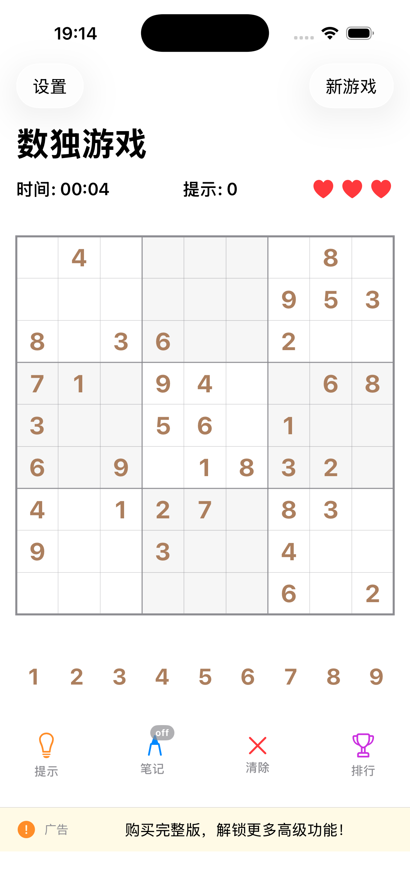 | 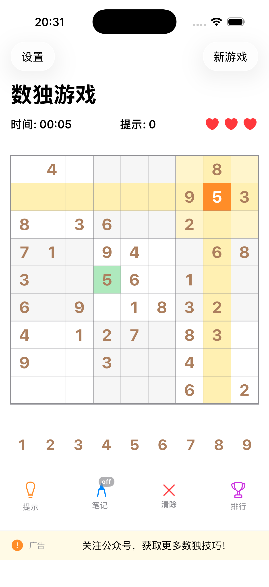 |
| 数独游戏主界面展示 | 选数格·行列亮·九宫亮·同数亮 |

| 截图3 - 空格数字选择 | 截图4 - 填数 |
|:---:|:---:|
| 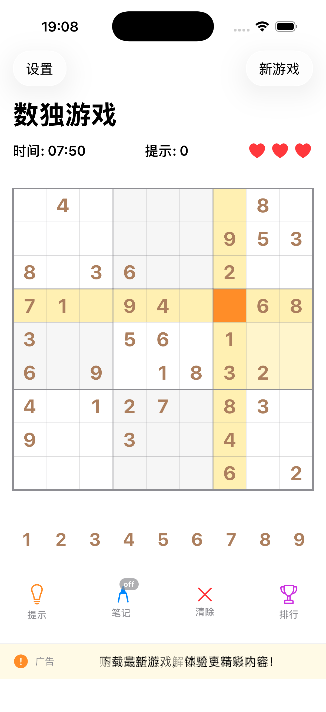 | 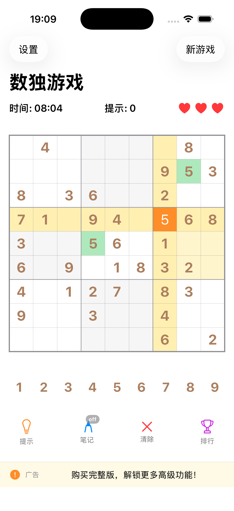 |
| 选空格变橙色，行列宫格高亮显示 | 候选区点击合适数字，填入选中空格 |

| 截图5 - 笔记模式 | 截图6 - 清除模式 |
|:---:|:---:|
| 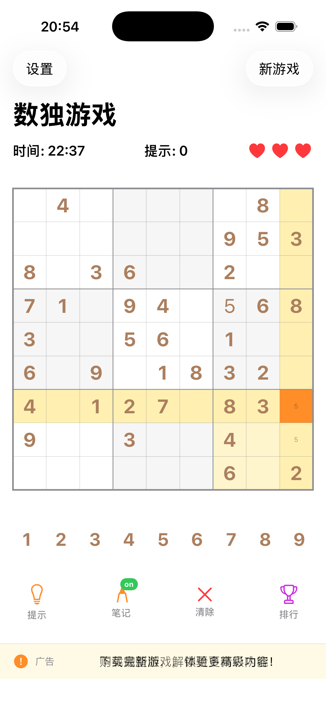 | 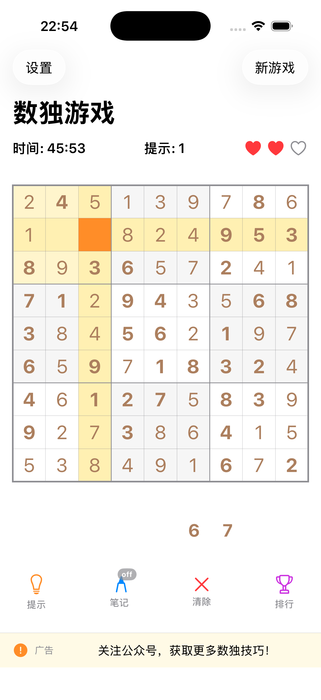 |
| 点击笔记按钮off变on，选空格，填笔记数字，笔记可填多个；如恢复填数模式，再次点击笔记按钮on变off  | 选中填入数字的鸽子，点击清除|


| 截图7 - 成功完成 | 截图8 - 游戏终止 |
|:---:|:---:|
| 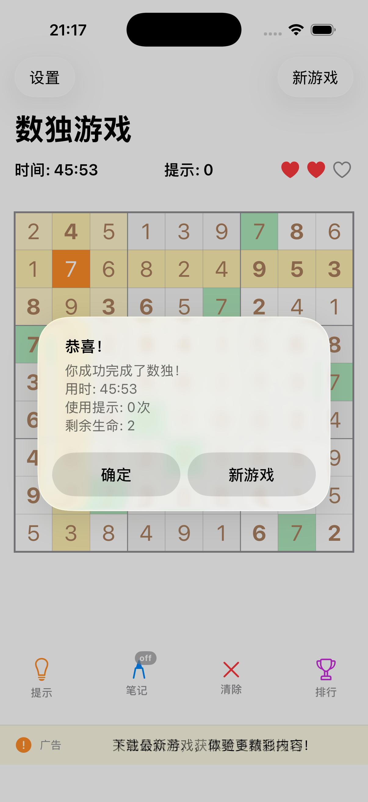 | 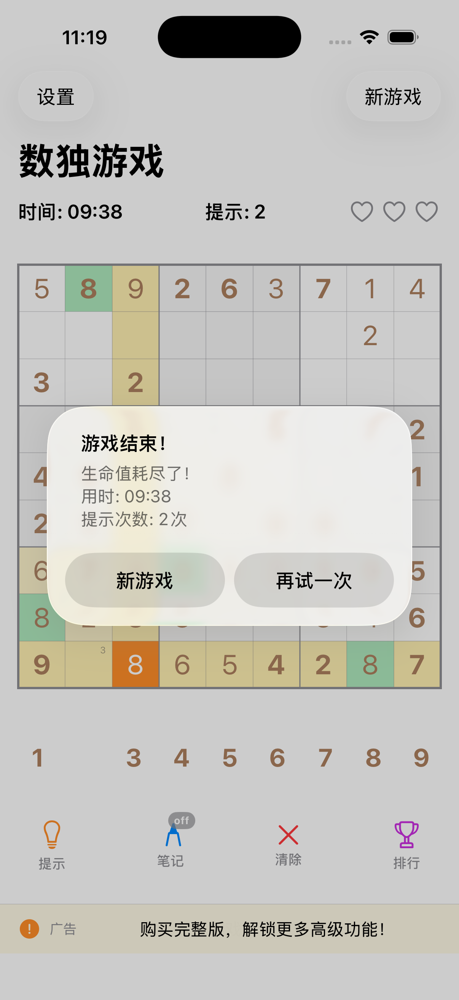 |
| 成功完成界面展示 | 如果填入错误3次·生命值耗尽 |


| 截图9 - 新游戏-游戏难度 | 截图10 - 设置页面 |
|:---:|:---:|
| 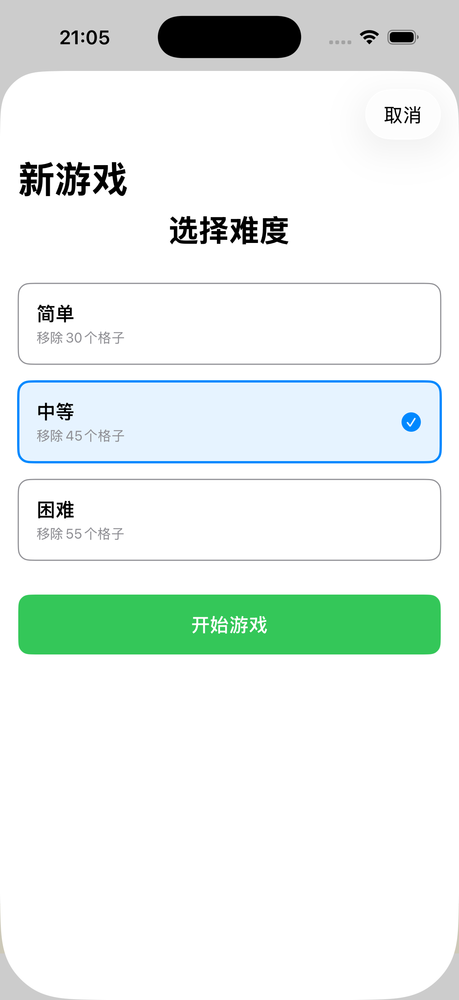 |  |
| 新游戏：选择难度 | 有关·app的信息 |

| 截图11 - 用户档案 | 截图12 - 排行榜 |
|:---:|:---:|
| 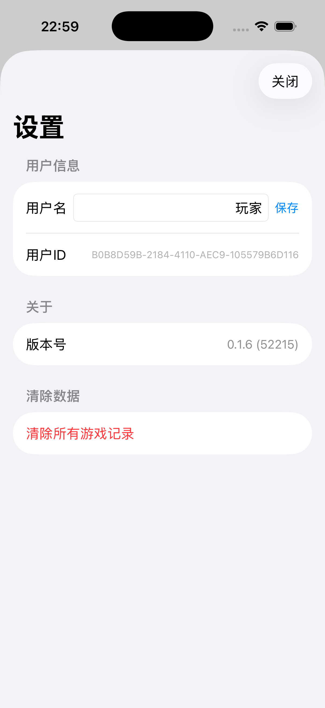 | 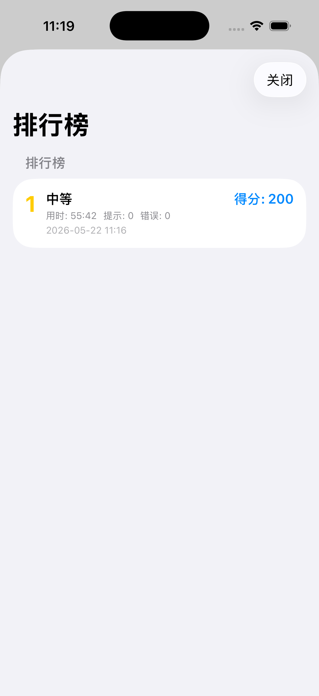 |
| 用户档案展示 | 简单排行榜 |

## 功能特性

### 核心游戏功能
- ✅ 完整的数独游戏逻辑
- ✅ 三种难度级别（简单、中等、困难）
- ✅ 智能提示功能
- ✅ 错误检测和标记
- ✅ 游戏计时器
- ✅ 美观的用户界面
- ✅ 支持iPhone和iPad

### 智能辅助功能
- ✅ **提示模式**：点击数字，该数字所在的行、列、宫格高亮显示
- ✅ **相同数字高亮**：其他宫格中相同的数字显示绿色背景
- ✅ **三层边框**：外层粗边框、宫格中边框、单元格细边框
- ✅ **数字颜色区分**：原始数字（深棕色）、用户填入（稍亮棕色）、选中（白色+橙色背景）

### 数字输入优化
- ✅ **自动隐藏按钮**：某个数字全部填满后，该数字按钮自动隐藏

### 游戏记录和排行榜
- ✅ **记录保存**：错误次数、提示次数、完成时间、难度级别
- ✅ **排行榜系统**：按得分排序，保存最近20条记录
- ✅ **用户设置**：自定义用户名、清除记录

## 项目结构

```
SudokuGame/
├── SudokuGame.xcodeproj/          # Xcode项目文件
├── SudokuGame/                    # 源代码
│   ├── SudokuGameApp.swift        # 应用入口
│   ├── GameView.swift             # 游戏主界面
│   ├── SudokuEngine.swift         # 数独核心算法
│   ├── GameManager.swift          # 游戏状态管理
│   ├── GameConfig.swift           # 配置管理（新增）
│   ├── GameRecords.swift          # 记录和排行榜（新增）
│   └── Info.plist                # 应用配置
├── screenshots/                   # 应用截图
├── PROJECT_DOCUMENTATION.md       # 完整项目文档
├── PROJECT_SUMMARY.md             # 项目总结
├── QUICKSTART.md                  # 快速上手指南
└── README.md                      # 本文档
```

## 如何编译和运行

### 方法一：使用Xcode（推荐）

1. **安装Xcode**
   - 从Mac App Store下载并安装Xcode 15.0或更高版本
   - 确保已安装Xcode Command Line Tools

2. **打开项目**
   ```bash
   cd SudokuGame
   open SudokuGame.xcodeproj
   ```

3. **配置开发者账号**
   - 在Xcode中，选择项目导航器中的"SudokuGame"项目
   - 在"Signing & Capabilities"标签页中
   - 选择你的开发团队（Team）
   - 如果没有开发者账号，可以选择"Sign to Run Locally"

4. **选择目标设备**
   - 在Xcode顶部工具栏，选择目标设备
   - 可以选择模拟器（如iPhone 17）或真机

5. **编译和运行**
   - 点击运行按钮（▶️）或按 `Cmd + R`
   - 等待编译完成，应用将自动启动

### 方法二：使用命令行编译

```bash
cd SudokuGame
xcodebuild -project SudokuGame.xcodeproj -scheme SudokuGame -configuration Debug build
```

## 游戏玩法

### 1. 开始游戏
- 打开应用后自动开始新游戏
- 点击右上角"新游戏"可以选择难度

### 2. 填写数字
- 点击空白格子选中
- 点击底部数字按钮填入数字
- 原始数字（深棕色粗体）不可修改

### 3. 使用提示
- 点击"提示"按钮获取帮助
- 系统会自动填入一个正确的数字
- 提示次数会被记录

### 4. 清除数字
- 选中格子后点击"清除"按钮
- 只能清除自己填入的数字

### 5. 高亮辅助
- 点击任意数字格子
- 该数字所在的行、列、宫格高亮显示（浅黄色）
- 其他宫格中相同的数字显示绿色背景
- 选中的格子显示橙色背景，白色文字

### 6. 查看排行榜
- 点击"排行"按钮查看历史记录
- 显示得分、难度、用时等信息

### 7. 设置
- 点击"设置"进入设置页面
- 修改用户名
- 清除所有游戏记录

### 8. 完成游戏
- 正确填满所有格子后游戏完成
- 显示用时、提示次数、错误次数
- 自动保存记录到排行榜

## 技术细节

### 核心算法
- **数独生成**：使用回溯算法生成有效数独
- **难度控制**：通过移除不同数量的数字实现
- **提示系统**：智能分析可能的数字，优先提示唯一解
- **验证系统**：实时检查行、列、宫格的有效性

### UI设计
- 使用SwiftUI构建声明式UI
- 响应式布局，适配不同屏幕尺寸
- 清晰的视觉反馈（高亮、选中、错误等）

### 数据持久化
- 使用UserDefaults存储游戏记录
- 支持自定义用户名
- 保存最近20条记录

## 得分计算规则

```
得分 = 基础分 + 时间奖励 - 错误惩罚 - 提示惩罚
```

- **基础分**：简单100分，中等200分，困难300分
- **时间奖励**：max(0, 300 - 用时秒数)，用时越短奖励越多
- **错误惩罚**：错误次数 × 10分
- **提示惩罚**：提示次数 × 5分

## 系统要求

- iOS 15.6或更高版本
- Xcode 15.0或更高版本（开发）
- Swift 5.0

## 完整文档

如需了解更多详细信息，请查看：
- [PROJECT_DOCUMENTATION.md](PROJECT_DOCUMENTATION.md) - 完整项目文档
- [QUICKSTART.md](QUICKSTART.md) - 快速上手指南
- [PROJECT_SUMMARY.md](PROJECT_SUMMARY.md) - 项目总结

## 许可证

本项目仅供学习和个人使用。

## 更新记录

### v2.0 - 2026-05-03
- ✨ 新增：完整的游戏记录和排行榜系统
- ✨ 新增：智能提示模式（行列、宫格、相同数字高亮）
- ✨ 新增：三层边框系统和颜色区分
- ✨ 新增：数字按钮自动隐藏
- ✨ 新增：用户设置功能
- ✨ 新增：配置统一管理（GameConfig.swift）
- 🐛 修复：所有编译错误和签名问题
- 📝 完善：项目文档

### v1.0 - 初始版本
- ✨ 基础数独游戏功能
